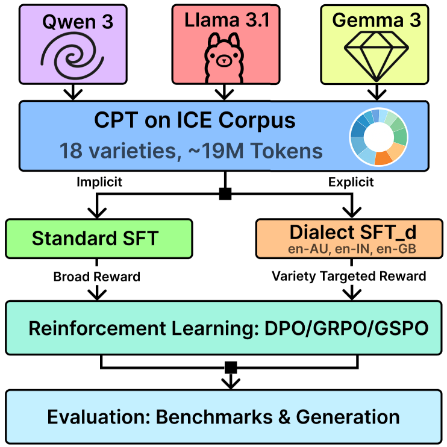

<div align="center">

# DiaLLM - An Investigation into the Robustness-Generation Gap in English Dialect Adaptation

Jordan Painter · Dipankar Srirag · Adarsh Kappiyath · Diptesh Kanojia · Aditya Joshi · Lu Yin

*Institute for People-Centered AI, University of Surrey & University of New South Wales*

[](https://arxiv.org/abs/2607.07669)
[](https://huggingface.co/jordanpainter/collections)
[](https://github.com/surrey-nlp)



</div>

---

## Overview

DiaLLM applies a three-stage post-training pipeline to three open-weight LLM families (Llama 3.1-8B, Qwen3-8B, Gemma 3-4B-it) for dialect adaptation across Australian English (en-AU), Indian English (en-IN), and Northern British English (en-UK):

0. **CPT** — continued pre-training on dialectal corpora (not covered here; based on [Q-GaLore](https://github.com/VITA-Group/Q-GaLore) with minor modifications)
1. **SFT** — supervised fine-tuning on dialectal preference data (`src/sft.py`)
2. **DPO** — direct preference optimisation (`src/dpo.py`)
3. **GRPO / GSPO** — online reinforcement learning with a composite dialect reward (`src/train.py`)

Two adaptation paradigms are compared:
- **Implicit**: broad training on all three varieties combined, no variety targeting
- **Explicit**: single-variety targeting throughout, using dialect-specific reward masking

---

## Repository Structure

```
configs/
  sft/          # Example SFT config (see note below)
  dpo/          # DPO configs — one per model × variety
  grpo/         # GRPO configs — one per model × variety (+ broad -all variants)
  gspo/         # GSPO configs — one per model × variety (+ broad -all variants)
src/
  sft.py        # SFT training script
  dpo.py        # DPO training script
  train.py      # Unified GRPO/GSPO training script
  formatting.py # Prompt formatting utilities
rewards/
  dialect_reward.py        # Combined reward function
  dialect_reward_model.py  # DialectDensityScorer (feature masking)
  dialect_feature_model.py # MultiheadDialectFeatureModel (BERT classifier wrapper)
  comet_reward.py          # COMET meaning-preservation reward
  sim_reward.py            # Cosine similarity reward
scripts/
  train_dialect_classifier.py   # Train the dialect feature classifier
  run_classifier_inference.py   # Run classifier over model outputs
  run_feature_inference.py      # Extract per-feature probabilities
  run_llm_judge.py              # LLM-as-judge evaluation
  analyse_llm_judge.py          # Aggregate LLM judge results
  plot_training_dynamics.py     # Plot W&B training curves
  wandb_summary.py              # Summarise W&B runs
  gen_configs.py                # Generate configs programmatically
  gen_sub_files.py              # Generate SLURM submission scripts
sub/
  dpo/   # SLURM submission scripts for DPO runs
  grpo/  # SLURM submission scripts for GRPO runs
  gspo/  # SLURM submission scripts for GSPO runs
model_cards/
  diallm-dialect-classifier.md  # Model card for the dialect feature classifier
```

---

## Installation

```bash
pip install -r requirements.txt
```

Experiments were run on NVIDIA A100 GPUs using `accelerate` for distributed execution. All runs use bfloat16 precision.

---

## Training

> **Note on configs**: All training is config-driven. The `configs/sft/` directory contains a single example config (`example_llama_australian.json`) to illustrate the format; the full set of SFT configs used in the paper follows the same structure and targets the dialectal preference datasets on HuggingFace. For GRPO/GSPO/DPO, all 36 configs (3 models × 3 varieties × 4 methods, plus broad-alignment variants) are provided.

> **Note on SLURM**: The `sub/` scripts are written for a SLURM-managed cluster. Adjust partition names, paths, and resource requests for your environment. The `scripts/gen_sub_files.py` utility can regenerate these from a template.

### SFT

```bash
python src/sft.py --config configs/sft/example_llama_australian.json
```

Or with `accelerate` for multi-GPU:

```bash
accelerate launch --num_processes=4 src/sft.py --config configs/sft/example_llama_australian.json
```

### DPO

```bash
python src/dpo.py --config configs/dpo/llama_aus.json
```

### GRPO / GSPO

Both methods use the same `train.py` entry point; the `"algorithm"` field in the config (`"grpo"` or `"gspo"`) selects between token-level and sequence-level importance sampling respectively.

```bash
accelerate launch --num_processes=1 -m src.train -c configs/gspo/llama_aus.json
accelerate launch --num_processes=1 -m src.train -c configs/grpo/llama_aus.json
```

---

## Reward Function

The composite reward used for GRPO/GSPO is:

$$R = \lambda \cdot \phi_{\text{dial}}(y) + \frac{1-\lambda}{2} \cdot \phi_{\text{comet}}(y, \hat{y}) + \frac{1-\lambda}{2} \cdot \phi_{\text{cos}}(y, \hat{y})$$

where $\phi_{\text{dial}}(y) = \log(1 + \sum_{i \in \mathcal{F}} \sigma(\text{logit}_i))$ is the log-sum dialect reward over the active eWAVE feature set $\mathcal{F}$, and $\lambda = 0.80$. All components are z-score normalised with an exponential moving average (decay 0.99, clip ±5).

For **explicit (variety-targeted) adaptation**, `dialect_feature_indices` in the config restricts $\mathcal{F}$ to the attested feature subset for the target variety (20 features for en-AU, 38 for en-IN, 30 for en-UK). For **implicit (broad) adaptation**, all 135 features are used.

The dialect feature classifier (`srirag/feature-identifier`) is a BERT-base encoder with 135 binary classification heads, one per eWAVE morphosyntactic feature.

---

## HuggingFace Resources

| Resource | Link |
|---|---|
| CPT checkpoints | `jordanpainter/diallm-{llama,qwen,gemma}-cpt` |
| SFT checkpoints (explicit) | `jordanpainter/diallm-{llama,qwen,gemma}-sft-{aus,ind,brit}` |
| DPO checkpoints (explicit) | `jordanpainter/diallm-{llama,qwen,gemma}-dpo-{aus,ind,brit}` |
| GRPO checkpoints (explicit) | `jordanpainter/diallm-{llama,qwen,gemma}-grpo-{aus,ind,brit}` |
| GSPO checkpoints (explicit) | `jordanpainter/dialect-{llama,qwen,gemma}-gspo-{aus,ind,brit}` |
| Preference datasets | `jordanpainter/alignment-{australian,british,indian}-final` |
| Dialect feature classifier | `srirag/feature-identifier` |

---

## Citation

```bibtex
@article{painter2026diallm,
  title     = {DiaLLM: An Investigation into the Robustness-Generation Gap in English Dialect Adaptation},
  author    = {Painter, Jordan and Srirag, Dipankar and Kappiyath, Adarsh and Kanojia, Diptesh and Joshi, Aditya and Yin, Lu},
  year      = {2026}
}
```
